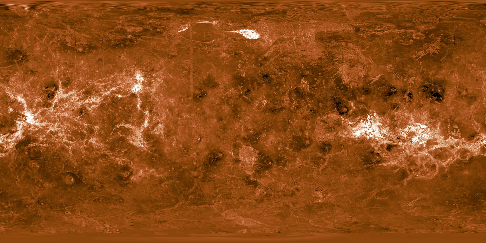
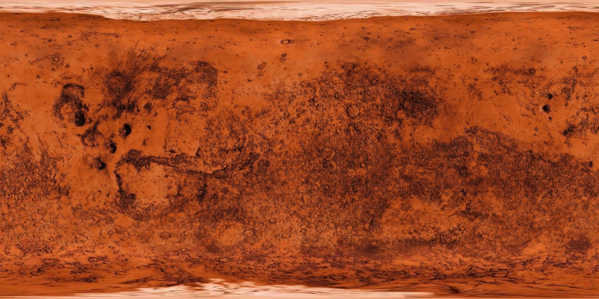
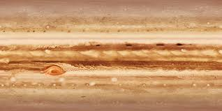
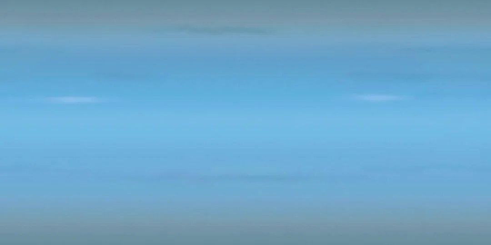

# CS460_FinalProject
Solar System Project

## Description
A 3D interactive solar system where users can explore planets and learn 
about them.
Key features include:
- **Realistic planetary textures and lighting effects**.
- **Interactive controls**: Zoom in and focus on individual planets.
- **Orbit path toggle** for a better understanding of planetary orbits.
- **Adjustable orbit speed** for the planets.
- **Twinkling Stars**, adding depth to the simulation.

If you'd like to run this simulation on your local machine, head to the [Installation](#installation) section. For usage instructions, check out the [Usage](#usage) section below.

---

# Installation

To set up the Solar System Simulation project locally, follow these steps:

1. **Clone the repository**:
   ```bash
   git clone https://github.com/QasimMasood/CS460_FinalProject.git
   cd CS460_FinalProject
2. **Install dependencies**:
   Ensure that you have Node.js and npm installed on your system. Then, navigate to the project folder and run the following command to install the required dependencies:
   ```bash
   npm install
3. **Start the development server**:
   To run the simulation locally, execute the following command:
   ```bash
   npm start

# Usage

- **Click on planets to focus**: Select any planet by clicking, and the camera will zoom into it.
- **Switch views**: Toggle between a bird’s-eye view and an angled view using the provided button.
- **Toggle orbit lines**: Use the orbit toggle button to display or hide planetary orbits.
- **Adjust orbit speed**: Use the slider to control the planetary orbit speeds.
- **Hover for details**: Hover over any celestial body to display its name in a tooltip.
- **Back button**: Return to the bird’s-eye view using the back button.

---

# Textures

## Sun


## Mercury


## Venus


## Earth


## Mars


## Jupiter


## Saturn


## Uranus


## Neptune

---

# Future Improvements

- Add realistic moon systems to planets like Earth and Jupiter.
- Implement dynamic time-lapse functionality for visualizing planetary motion over long periods.
- Add educational tooltips with planet-specific facts and trivia.
- Improve visuals with additional effects like atmospheric scattering or solar flares.

---

# Authors

Authors: 
- **Qasim Masood**
- **Alexander Troetsch**

This project was created as part of the CS460 - Graphics course at the University of Massachusetts Boston.

---
